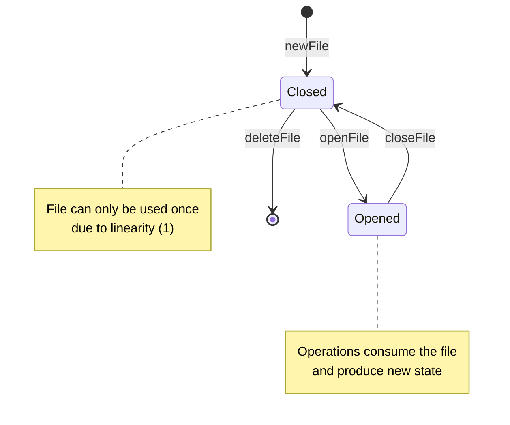

---
theme:
  name: catppuccin-latte
title: Idris2
authors: 
    - Zahra Khodabakhshian
    - Mehrdad Shahidi
    - "Supervisor: Cass Alexandru"
---

## Contents

- Background
- Equality in Idris
- Multiplicities in Idris
- Problem specification
- Demo 

<!-- end_slide -->
## Background
Idris 1 first introduced by Edwin Brady in 2009.
<!-- new_lines: 1 -->
Idris was one of the first languages to bring dependent types into the practical world of programming.


<!-- end_slide -->
## Equality in idris

### Propositional

```haskell
data (=) : a -> b -> Type where
Refl : x = x
```
```haskell
plus' : Nat -> Nat -> Nat
plus' Z y = y
plus' (S k) y = S (plus' k y)
```
```haskell
plusReducesL : (n : Nat) -> plus' Z n = n
plusReducesL n = Refl
```
```haskell
plusReducesR : (n: Nat) -> plus' n Z = n
plusReducesR 0 = Refl 
plusReducesR (S k) = 
  let rec = plusReducesR k in 
  rewrite rec in Refl

```

<!-- end_slide -->

### Heterogeneous Equality
Equality in Idris is Heterogeneous, meaning that we can even propose equalities between values in different type.

```haskell
vect_eq_length : (xs : Vect n a) -> (ys : Vect m a) ->
(xs = ys) -> n = m

vect_eq_length  v1 _ Refl = Refl

```

<!-- end_slide -->

## Multiplicities
<!-- new_lines: 1 -->
- Idris 2 is based on Quantitative Type Theory (QTT), a core language developed by Bob Atkey and Conor McBride.
- In practice, this means that every variable in Idris 2 has a quantity associated with it.

<!-- new_lines: 2 -->
```latex
0: The variable is used only at compile time and erased at runtime
1: The variable must be used exactly once at runtime (linear)
ω: The variable can be used any number of times (unrestricted)
```

<!-- end_slide -->
### Erasure
 it allows us to be precise about which values are relevant at run time!!!

 Idris 1 :
 ```haskell
vlen : Vect n a -> Nat
vlen {n} xs = n

 ```
Idris 1 infers whether n is needed at runtime.
 
 <!-- incremental_lists: false -->
Problem: The programmer has no explicit control or indication of whether n is retained at runtime or erased.
<!-- new_lines: 1 -->
Idris 2 :
```haskell
vlen : {n : Nat} -> Vect n a -> Nat
vlen xs = n

```
we need to state explicitly that n is needed at run time
The type now explicitly states that n is a compile-time implicit argument that will be passed as part of the function call.

<!-- end_slide -->
in Idris 2, names bound in types are also available in the definition without explicitly rebinding them.)

This also means that when you call vlen, you need the length available

```haskell
sumLengths : Vect m a -> Vect n a —> Nat
sumLengths xs ys = vlen xs + vlen ys
```

```haskell
vlen.idr:7:20--7:28:While processing right hand side of Main.sumLengths at vlen.idr:7:1--10:1:
m is not accessible in this context
```
<!-- end_slide -->
by replacing the right hand side of sumLengths with a hole…

```haskell
sumLengths : Vect m a -> Vect n a -> Nat
sumLengths xs ys = ?sumLengths_rhs
```
then checking the hole’s type 

```haskell
Main> :t sumLengths_rhs
 0 n : Nat
 0 a : Type
 0 m : Nat
   ys : Vect n a
   xs : Vect m a
-------------------------------------
sumLengths_rhs : Nat
```
we need to give bindings for m and n with unrestricted multiplicity

```haskell
sumLengths : {m, n : _} -> Vect m a -> Vect n a —> Nat
sumLengths xs ys = vlen xs + vlen xs
```
<!-- end_slide -->

One final note on erasure:
```haskell
badNot : (0 x : Bool) -> Bool
badNot False = True
badNot True = False
```
This is rejected with the error:
```haskell
badnot.idr:2:1--3:1:Attempt to match on erased argument False in
Main.badNot
```
The following, however, is fine.
```haskell
data SBool : Bool -> Type where
     SFalse : SBool False
     STrue  : SBool True
```
```haskell
sNot : (0 x : Bool) -> SBool x -> Bool
sNot False SFalse = True
sNot True  STrue  = False
```
<!-- end_slide -->
### Linearity
<!-- column_layout: [8,10] -->

<!-- column: 0 -->

```haskell
data FileState = Opened | Closed
```
```haskell
data File : FileState -> Type where
  MkFile : (fileName : String) -> File st
```
```haskell
openFile : (1 f : File Closed) -> File Opened
openFile (MkFile name) = MkFile name 
```
<!-- column: 1-->


```haskell
closeFile : (1 f : File Opened) -> File Closed
closeFile (MkFile name) = MkFile name
```
```haskell
deleteFile : (1 f : File Closed) -> IO ()
deleteFile (MkFile name) = putStrLn "File deleted."
```
```haskell
newFile : (1 p : (1 f : File Closed) -> IO ()) -> IO ()
newFile p = p (MkFile "example.txt")
```
<!-- reset_layout -->
```haskell
fileProg : IO ()
fileProg =
  newFile $ \f =>
    let f = openFile f 
        f = closeFile f in 
        deleteFile f

```
<!-- end_slide -->

<!-- end_slide -->

## Problem specification
-  Prove Correctness : 
```haskell
match: Regex Char -> List Char -> Bool
-- Correctness
correctness : (r : Regex Char) -> (s : List Char) ->   
             match r s = True <-> InLanguage r s 
```
### Regular expression
- Regex AST
```haskell
data Regex: (a: Type) -> Type where
  Empty: Regex a
  Epsilon: Regex a
  Chr : a -> Regex a
  Concat: Regex a -> Regex a -> Regex a
  Alt:  Regex a -> Regex a -> Regex a
  Star :  Regex a -> Regex a

```
<!-- end_slide -->
### Specify formal languages in idris
- We usually defined them in terms of Set Theory
```latex +render
$L = \{w \in \Sigma^* \mid P(w)\}$
```
- How we can define them in terms of Type Theory?
<!-- pause -->

```latex +render
$
\text{Lang} = A^* \rightarrow \text{Set } \ell $

```
<!-- column_layout: [2,3] -->

<!-- column: 0 -->
```latex +render
$\varnothing\ w = \bot $

$\mathcal{U}\ w = \top $

$1\ w = w \equiv []$

$'c\ w = w \equiv [c]$

$(s \cdot P)\ w = s \times P\ w$
```
<!-- column: 1 -->

```latex +render
$(P \cap Q)\ w = P\ w \times Q\ w  $


$(P \cup Q)\ w = P\ w \uplus Q\ w  $

$
(P * Q)\ w = \exists \lambda (u, v) \rightarrow (w \equiv u \mathbin{\#} v) \times P\ u \times Q\ v  $

$
 (P^\star)\ w = \exists \lambda\ ws \rightarrow (w \equiv \text{concat}\ ws) \times \text{All}\ P\ ws  $

```

<!-- end_slide -->
#### How in Idris looks like
<!-- column_layout: [2,3] -->

<!-- column: 0 -->
```haskell
Lang : (a: Type) -> Type
Lang a = List a -> Type

-- Empty language: no strings
empty : Lang a
empty _ = Void

-- Universal language: all strings
univ : Lang a
univ _ = Unit 

-- Language contain empty string
eps : Lang a
eps w = w = []

-- Single-token language
tok : a -> Lang a
tok c w = w = [c]

-- Scalar multiplication
-- not sure when this is useful
(:.:) : Type -> Lang a -> Lang a
(:.:) s l w = Pair s (l w)
```

<!-- column: 1 -->
```haskell
-- A ⊎ B
union: Lang a -> Lang a -> Lang a
union l1 l2 w = Either (l1 w) (l2 w)

-- A ∩ B
intersection: Lang a -> Lang a -> Lang a
intersection l1 l2 w = Pair (l1 w) (l2 w)

-- ∃ x. p x, idris couldn't resolve missing type
exists:{a, b : Type} -> (p: (Pair a b) -> Type) -> Type 
exists {a} {b} p =  DPair (a, b) p 

langConcat: {a: Type} -> Lang a -> Lang a -> Lang a  
langConcat l1 l2 w = exists (\ (w1 , w2) => 
    Pair (w = w1 ++ w2) (Pair (l1 w1) (l2 w2)))

concat: {a: Type} -> List (List a )-> List a
concat = foldr (++) []

langStar: {a: Type} -> Lang a -> Lang a
langStar l w  = 
    DPair _ (\ws => Pair (w = concat ws ) (All l ws))

```
<!-- end_slide -->

### Map regular expression to language

```haskell
lang : {a: Type } -> Regex a -> Lang a
lang Empty = empty
lang Epsilon = eps
lang (Chr c) = tok c
lang (Concat x y) = langConcat (lang x) (lang y)
lang (Alt x y) = union (lang x) (lang y)
lang (Star x) = langStar (lang x)
```


<!-- end_slide -->
## References

-  
- Elliott, Conal. "Symbolic and Automatic Differentiation of Languages." 2021.

